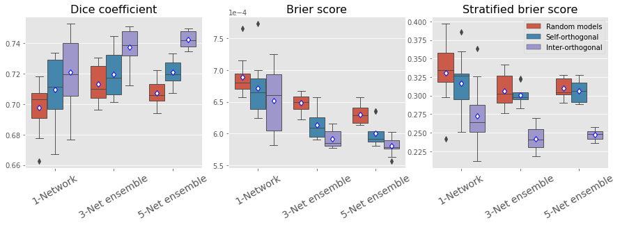

# Orthogonal Ensemble Networks
In this tutorial you will find all the steps and instructions you need in order to reproduce the experiments performed in "Orthogonal Ensemble Networks for Biomedical Image Segmentation" by Agostina Larrazabal, César Martínez, José Dolz, and Enzo Ferrante. October 2021.

## Requirements
The code has been written in Python (3.6) and requires TensorFlow (2.3)
You should also have installed the requirements:

```
pip install -r requirements.txt
```
## Pre-trained models

Our pre-trained models for wmh segmentation can be downloaded using the following link:
https://drive.google.com/drive/folders/1VSsDUmNoPNg3wGtRpa5LVHXgoeZWT_UQ?usp=sharing

## Training:

First, make sure that in "config_file.ini" the patches_directory contains the path where you have saved the image parches.

- The model can be trained using below command:

```
python training_ensemble.py
```

Part of this code is based on the following publicly available implementation: 

https://github.com/samaonline/Orthogonal-Convolutional-Neural-Networks/

  
## Predicting segmentation:


First, make sure that in "config_file.ini" the image_source_dir contains the path where you have download the dataset.
The pretrained_models_folds contains the path with our pre-trained models for wmh dataset

The file "metadata.txt" contains the partition that we used in this paper

 - The hold out images can be segmented using the bellow command:
 
 ```
python predict.py
```


## Testing:

First, make sure that in "config_file.ini" has the correct ensemble parametes.
Run the testing script with the following command:

```
python metrics_estimation.py
```

  
When the testing is over, you will find the txt files with the result for the different configurations. 

#Results

# Results




Quantitative evaluation of the proposed method for WMH segmentation. We measure Dice coefficient to assess the segmentation quality, while Brier score and stratified Brier score account for calibration quality. Boxplots show mean and standard deviation for predictions obtained with individual models, 3-networks ensembles and 5-networks ensembles.

